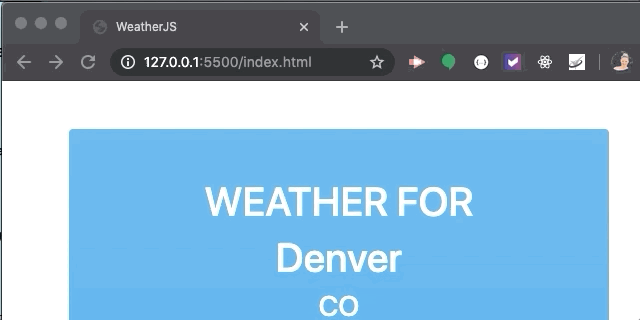
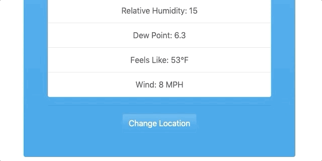
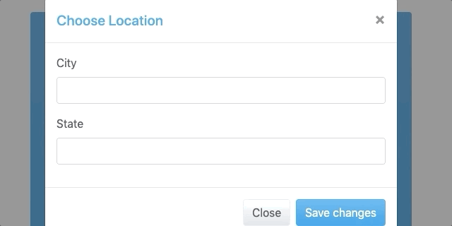
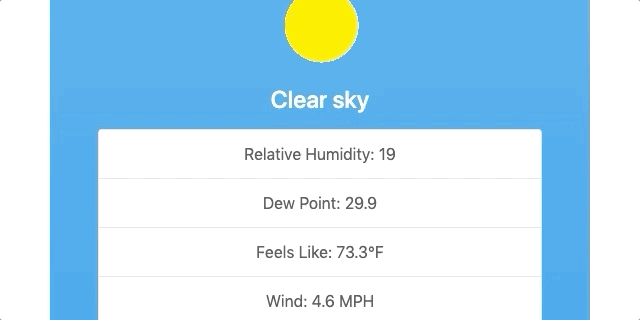

# WeatherJS

### What it does
Default city is Denver, CO.  Choose what city you would like the current weather for and the app calls to the WeatherBit API and gives you the current temperature, relative humidity, dew point, "feels like" temp, and wind speed.  Feel free to change location and the info will persist to local storage. 

## See It In Action
Giphys

---

---

---

---

---

[Check out a full video of the app here](https://drive.google.com/file/d/1IUX6qzGL5wfrLLU3HmCrALZwvplTjeaO/view?usp=sharing)

### Technologies Used
* JavaScript
* Bootswatch
* Bootstrap
* Weatherbit API
* JQuery